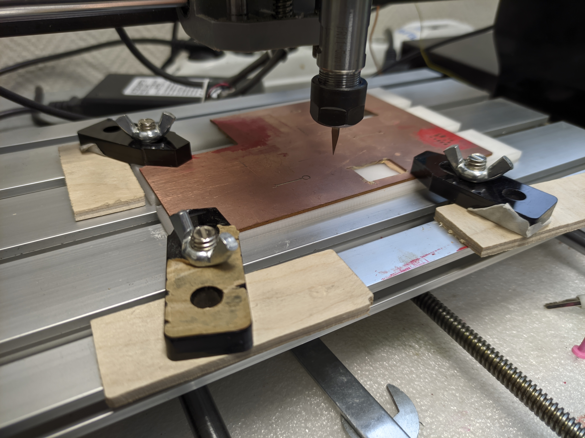

# CNC3018
## Содержание
1. Подготовка платы в Kicad
1. Экспорт Gerber файлов
1. Создание gcode с помощью pcb2gcode
1. Подготовка станка
1. Фрезерование дорожек
1. Сверление отверстий
1. Выпил платы
1. ???
1. PROFIT!

## Подготовка платы в Kicad

**Данный туториал не является туториалом по разработке печатных плат в Kicad, здесь описана только подготовка платы к изготовлению.**

### Настройка ограничений 
Перед разводкой платы необходимо указать минимальный зазор (должен быть больше либо равен диаметру фрезы) и минимальную ширину дорожки в меню `Файл > Параметры платы` 
### Добавление начала координат и границ
Начало координат будет соответствовать координатам (0; 0) станка, нужно поставить его в нижнем левом углу платы.

Для того, чтобы фрезер мог вырезать плату из большого куска текстолита, нужно обозначить её границу. Для этого необходимо добавить прямоугольник на слой `Edge.Cuts`.


## Экспорт Gerber файлов
Для экспорта Gerber фалов нужно выбрать пункт меню `Файл > Файлы для производства > Gerbers`. В открывшемся диалоге нужно:
1. Выбрать папку, в которую будут записаны Gerber файлы
1. Включить `Использовать начало координат сверловки/размещения` (иначе фрезер за начало координат примет нижний левый угол листа в Kicad)
1. Выключить `Использовать расширенный формат X2` (если такой пункт есть)
1. Выбрать слои `F.Cu` (дорожки) и `Edge.Cuts` (граница платы)
1. Нажать `Чертить` 
1. Нажать `Cформировать фалы сверловки`
1. В открывшемся окне нажать `Создать файл сверловки`

## Создание gcode с помощью pcb2gcode
Gerber файлы описывают геометрию платы, gcode файлы - список инструкций вида "перемести ось X на 1 мм". Gcode нужно создавать для конкретного станка и инструментов (фрез, свёрл). Я пробовал две программы для этого - FlatCam и pcb2gcode, но FlatCam не открывает некоторые Gerber файлы, поэтому не будет рассмотрен.

pcb2gcode не имеет графического интерфейса, её настройка проводится через config файл. Пример:
```
# настройки Pcb2GCode
metric=true                     # использовать метрическую систему
metricoutput=true
zero-start=true
zsafe=4                         # высота перемещений инструмента над платой
zchange=5                       # высота, на которой фрезере остановится для смены инструмента
milling-overlap=10%             # наложение проходов фрезы (см. ниже)
output-dir=.                    # путь, куда будет записан gcode
nom6=true                       # иначе фрезер не работает
nog81=true                      # иначе фрезер не работает
nog64=true                      # иначе фрезер не работает
nog91-1=true                    # иначе фрезер не работает
#mirror-axis=1

# Изоляция
zwork=-0.15                     # Рабочая высота (толщина слоя меди, который необходимо убрать)
mill-feed=30                    # скорость перемещения во время фрезерования
mill-speed=200                  # скорость вращения фрезы
mill-diameters=0.7              # диаметр фрезы
isolation-width=1               # ширина изоляции между областями меди (если больше диаметра фрезы, будет совершено несколько проходов)

# Сверление отвепстий
zdrill=-1.48                    # глубина сверления (если под текстолитом есть подложка, ставьте ширину платы + 0.2)
drill-feed=250                  # вертикальная скорость сверления
drill-speed=200                 # скорость вращения сверла
onedrill=1

# Вырезание контура платы
zcut=-1.48                      # глубина вырезания платы
cut-feed=30                     # скорость вырезания платы
cut-speed=200                   # скорость вращения фрезы
cut-infeed=1                    # какую глубину вырезать за 1 проход
cutter-diameter=1mm             # диаметр инструмента
```
Более подробная информация: `man pcb2gcode`.

Чтобы создать gcode, нужно выполнить команду `pcb2gcode --config <путь к файлу настроек> --front tutorial-F_Cu.gbr --drill tutorial-PTH.drl --outline tutorial-Edge_Cuts.gbr`,
где вместо tutorial-*.gbr нужно подставить пути к своим Gerber файлам.

Значения имён файлов:
* F_Cu.gbr - слой меди
* Edge_Cuts.gbr - контур платы
* PTH.drl - покрытые медью отверстия
* NPTH.drl - не покрытые медью отверстия

## Подготовка станка
Для управления станком используется `Universal Gcode Sender` (`UGS`)


### Интерфейс UGS

1. Подключиться к станку
2. Запустить gcode программу
3. Установить 0 по оси X
4. Установить 0 по оси Y
5. Автолевелер (построение карты высот) (можно открыть через `Window > Plugins > AutoLeveler`)
6. Инструменты (см. ниже)

#### Jog controller
  
Позволяет управлять станком в ручном режиме. Для изменения скорости меняйте `Feed Rate`.

#### Macros
  
Позволяют исполнять заранее записанные последовательности gcode команд. Изначально доступен только `Go to XY zero`, свои макросы можно добавить в настройках. В хакспейсе добавлен макрос `Zero probe`, его код:  
```G21G91G38.2Z-30F80; G0Z1; G38.2Z-2F20; G92Z0; G0Z2```
* `Go to XY zero` - переместить сверло в начало координат. **Не изменяет вертикальное положение сверла** 
* `Zero probe` - Установить 0 по оси Z на высоту меди под сверлом (см. ниже). **Не использовать без подключенной пробы.**

### Подготовка
1. Установка фрезы  
Установите нужную вам фрезу

1. Крепление текстолита на столе

1. Установка начала координат   
C помощью `Jog Controller` переместите сверло в желаемое начало координат (оно будет совпадать с началом координат, указанным в kicad), обнулите положение осей X и Y (кнопки X0, Y0)  
a4e56
1. Установка 0 по Z
Подключите провода пробы (белый - на сверло, желтый - на плату)

Запустить макрос `Zero probe`.
**Этот шаг необходимо повторять после каждой смены инструмента.**
1. Построение карты высот  
Так как текстолит не ровный, и мог выгнуться при закреплении, нужно построить карту высот для коррекции этой неровности. Для этого на вкладке `AutoLeveler` нужно установить минимальные и максимальные x и y так, чтобы плата целиком помещалась в эти границы, установить min z = -2, max z = 0.7, поставить адекватное resolution (10 - нормально) и нажать Scan surface.
1. Отключение проводов  
Отключите провода

**ПОСЛЕ ПОДГОТОВКИ НЕ ОТКРЕПЛЯЙТЕ ПЛАТУ ОТ СТОЛА, НЕ ОТКЛЮЧАЙТЕ СТАНОК, НЕ ПЕРЕЗАПУСКАЙТЕ UGS, НЕ ОБНУЛЯЙТЕ ПОЛОЖЕНИЕ ОСЕЙ X И Y**

### Изоляция
Откройте файл `front.ngc`. На вкладке `AutoLeveler` нажмите `Apply to Gcode`. Нажмите кнопку пуск, если станок остановится в состоянии `HOLD`, нажмите пуск снова.

### Сверление отверстий
Поменяйте фрезу на сверло, откройте `drill.ngc`, сделайте `Zero Probe` (перед этим подключите провода и переместите сверло в горизонтальное начало координат), нажмите `Apply to gcode`, запускайте.

### Вырезание платы по контуру
Поставьте сверло обратно, откройте `outline.ngc`, сделайте `Zero Probe` (перед этим подключите провода и переместите сверло в горизонтальное начало координат), нажмите `Apply to gcode`, запускайте.

### ???
### PROFIT!